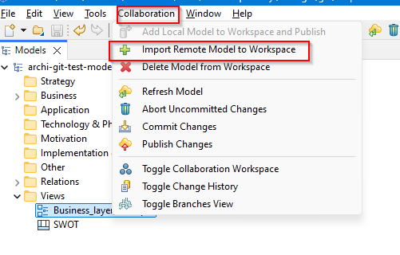
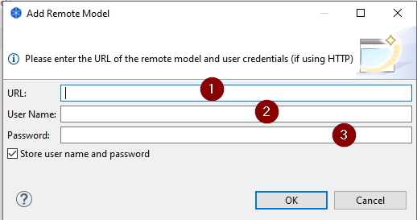
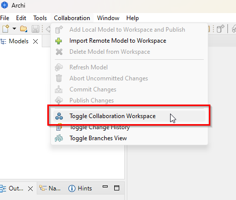
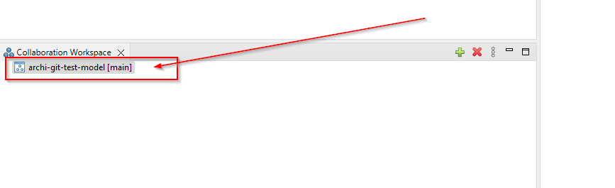
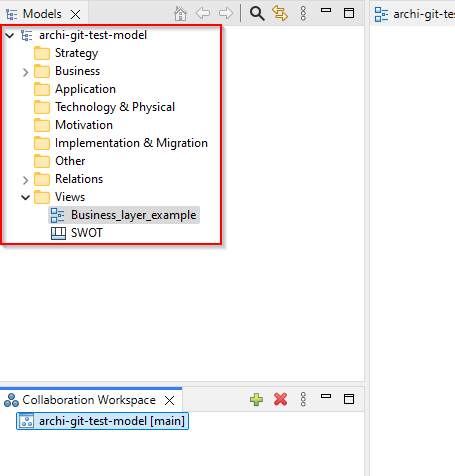

# Verzování Archi Gitem

Instalace a konfigurace nástrojů nutných pro použití Gitu jako verzovácího nástroje Archi.

## Prerekvizity

Prerekvizity jsou:

* Git - instrukce k instalaci viz [Instalace systému Git](https://git-scm.com/book/cs/v2/%C3%9Avod-Instalace-syst%C3%A9mu-Git)
* Archi - je potřeba Archi minimálně ve verzi 5.3 - [archimatetool.com](https://www.archimatetool.com/)
* coArchi - plugin na spolupráci pomocí gitu - [coArchi plugin](https://www.archimatetool.com/plugins/)
* účet na Github a vygenerovaný PAT token viz [návod na generování PAT](https://docs.github.com/en/authentication/keeping-your-account-and-data-secure/managing-your-personal-access-tokens)

Pro používání ve firemním prostředí (a Windows), zvláště pokud používáte SASE řešení (např. Zscaler ) terminující SSL, je obvykle nutné provést úpravu popsanou ve [wiki](https://github.com/archimatetool/archi-modelrepository-plugin/wiki/Use-SSL-TLS-with-local-or-private-PKI). Tato spočívá v přidání následujících řádek do souboru Archi.ini (obvykle v C:\Program Files\Archi\Archi.ini)

```markdown
-Djavax.net.ssl.trustStore=NUL
-Djavax.net.ssl.trustStoreType=WINDOWS-ROOT
```
  
## Konfigurace připojení

Následně je potřeba konfigurace připojení k repozitory. Po naistalování pluginu se v Archi objeví položka *Collaboration*. Vybereme model (ideálně prázdný a uložený) v panelu models a zvolíme *Import Remote Model to Workspace* viz screenshot.



Pokud nemáme heslo k vault storage tak si jej zvolíme. Následně se připojíme ke githubu zadáním URL repository (1), uživatelským jménem (2) a PAT tokenem (3) viz screenshot.



Následně Archi stáhne model a updatne jej. Tím je model připraven na práci. Změny v modelu je nutné nejprve commitnout (Commit Changes) a následně provést jejich nahrání (Publish Changes).

Pokud model neuvidíte poté co jste se úspěšně přihlásili do repository, vyberte z menu *Collaboration* položku *Toggle Collaboration Workspace* viz screenshot.



Následně je obvykle v dolní části otevřen panel s dostupnými workspaci viz screenshot.



Dvojklikem jej otevřeme a lze v něm pracovat.



## Přispívání

Pro práci s repozitory je vhodné vychát  z následujících pravidel:

-  Primárně přispíváme prostřednictvím Archi nástroje.
- Složka model obsahuje vlastní model nesmí se modifikovat ručně (riziko rozhození konzistence modelu)
- Před provedením změn proveďte Refresh Model.
- Pro aplikaci změn je nutné provést commit(Commit Chnages) a nahrání(Publish Changes).
- Při commitu změn uveďte stručně záměr změny do popisu commitu.
- Pokud dojde ke konfliktu přispěvatel je odpovědný za jeho vyřešení.
- Pro odkládání(zafixování) důležitých verzí použijeme tagy.  
